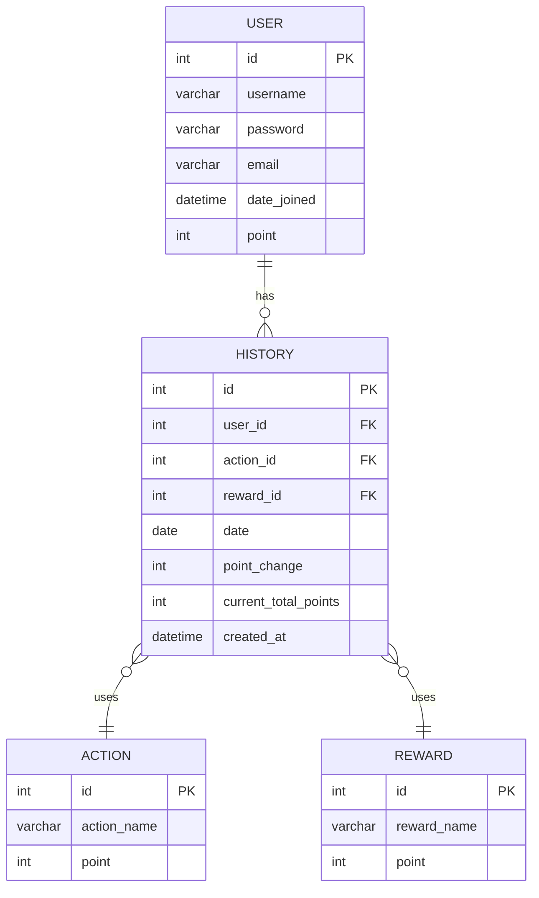
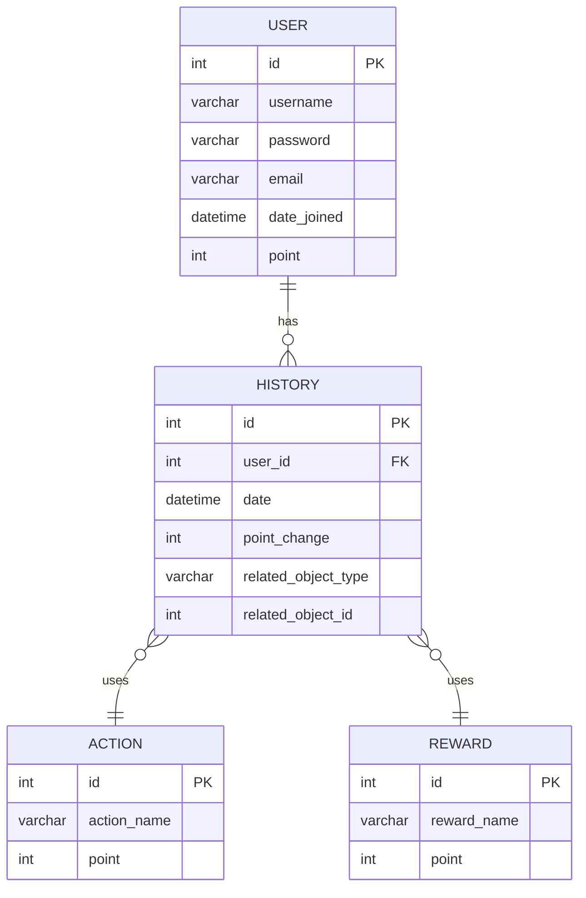

# HISTORYテーブル: NULL値の発生を防ぐ

## 現在の設計

### 説明

*   **USER**: ユーザー情報を保持
*   **HISTORY**: ポイントの変動履歴を保持。どのアクションまたはリワードによってポイントが変動したかを記録。
*   **ACTION**: ユーザーが実行できるアクションを定義。
*   **REWARD**: ユーザーが獲得できるリワードを定義。

### 問題点
*   `action_id`もしくは`reward_id`どちらかが常にNULLになる

## 改善案

### 変更点

*   `HISTORY`テーブルから`action_id`と`reward_id`を削除し、代わりに`related_object_type`と`related_object_id`を追加。これにより、常に`action_id`もしくは`reward_id`のどちらかが`NULL`になる状態を回避できる。